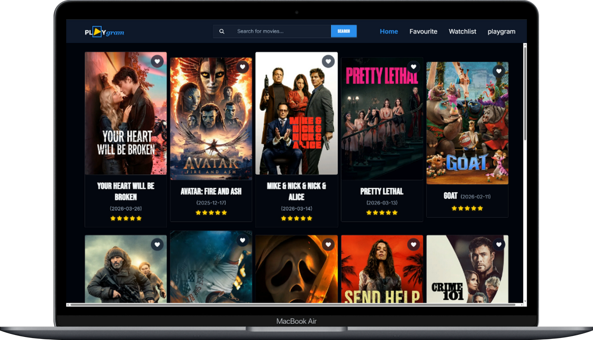
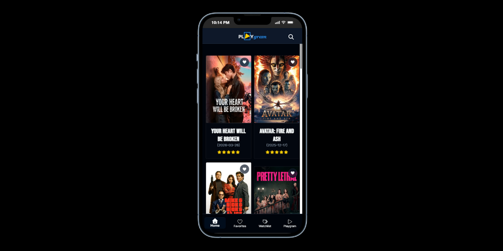

# Playgcrawler - Premium Movie Discovery Platform

A sleek, high-performance movie link crawler web app designed for film enthusiasts. Playgram delivers a cinematic discovery experience with a polished iOS-inspired interface, custom search functionality, and fluid animations built with React and Vite.

## ✨ Features

- **Pro Search Interface** - Seamless, auto-focusing search bar that adapts perfectly on mobile devices
- **Cinematic Hover Effects** - Glittering glass wave animations on movie posters that simulate light reflecting off polished glass
- **Intelligent Navigation** - Adaptive breadcrumbs with automatic browsing history tracking
- **Modern Tech Stack** - React 18, Vite for lightning-fast HMR, and FontAwesome iconography
- **Premium Aesthetic** - Deep navy and near-black theme centered around Telegram Blue (#3390EC) action items
- **Fully Responsive** - Optimized experience across desktop, tablet, and mobile devices
- **Custom Movie Link Crawler** - Intelligent aggregation and curation of movie sources

## 🎬 Visual Design

Playgram features a neo-noir cinematic UI with:
- Apple-style minimalist design language
- Smooth glass morphism effects
- Polished desktop and mobile interfaces
- Fluid transitions and micro-interactions




## 🚀 Getting Started

### Prerequisites
- Node.js (v16 or higher)
- npm or yarn package manager

### Installation

1. Clone the repository
```bash
git clone https://github.com/DamieMegah/play-crawler.git
cd play-crawler
```

2. Install dependencies
```bash
npm install
```

3. Start the development server
```bash
npm run dev
```

The application will be available at `http://localhost:5173` (or the port shown in your terminal)

## 📦 Build for Production

```bash
npm run build
```

This creates an optimized production build in the `dist` directory.

## 🛠️ Tech Stack

| Category | Technology |
|----------|-----------|
| **Frontend Framework** | React.js, Vite |
| **Styling** | CSS3 (Custom Variables, Keyframe Animations) |
| **Icons** | FontAwesome |
| **Routing** | React Router Dom |
| **Design** | Neo-noir / Cinematic UI |

## 📁 Project Structure

```
play-crawler/
├── src/
│   ├── components/      # React components
│   ├── pages/          # Page components
│   ├── assets/         # Images and media
│   ├── styles/         # CSS styling
│   ├── App.jsx         # Main app component
│   └── main.jsx        # Entry point
├── index.html          # HTML template
├── vite.config.js      # Vite configuration
└── package.json        # Project dependencies
```

## 💡 Usage

1. **Search for Movies** - Use the pro search interface to find your favorite films
2. **Explore Catalog** - Discover movies with immersive cinematic animations
3. **Navigate Intuitively** - Use adaptive breadcrumbs to track your journey
4. **Access Movie Links** - Browse aggregated sources and streaming options

## 🎨 Design Philosophy

Playgram prioritizes the user experience with:
- **Minimalist Modern Aesthetics** - Inspired by Apple's design language
- **Smooth Visual Feedback** - Glass wave effects and fluid transitions
- **Intuitive Navigation** - Effortless movie discovery and browsing
- **Premium Color Palette** - Deep navy backgrounds with Telegram Blue accents
- **Performance First** - Lightning-fast load times with Vite

## 📊 Language Composition

- **JavaScript** - 68.4%
- **CSS** - 31.4%
- **HTML** - 0.2%

## 🤝 Contributing

Contributions are welcome! To contribute:

1. Fork the repository
2. Create a feature branch (`git checkout -b feature/amazing-feature`)
3. Commit your changes (`git commit -m 'Add amazing feature'`)
4. Push to the branch (`git push origin feature/amazing-feature`)
5. Open a Pull Request

Please ensure your code follows the existing style and includes appropriate comments.

## 📄 License

This project is open source. Please check the LICENSE file for details.

## 🙋 Support & Feedback

For issues, feature requests, or questions, please open an issue on the [GitHub Issues](https://github.com/DamieMegah/play-crawler/issues) page.

## 👤 Author

**DamieMegah**

---

**Made with ❤️ for movie enthusiasts who value premium experiences**
